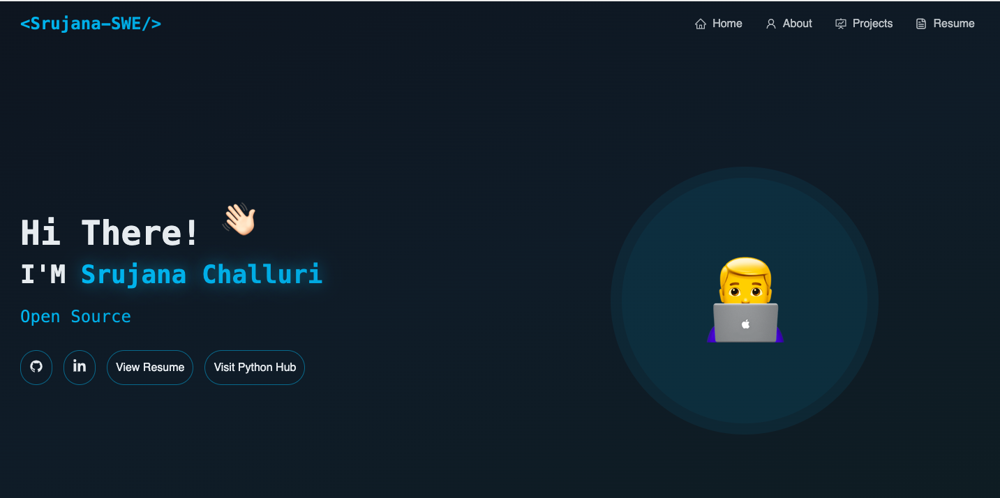

# 🚀 Developer Portfolio

A modern, dark-themed developer portfolio built with React, TypeScript, Tailwind CSS, and Framer Motion.

---

<p align="center">
  <a href="https://master-portfolio-rho.vercel.app/">
    
  </a>
  &nbsp;
  <a href="https://github.com/srujanachalluri/MasterPortfolio">
    
  </a>
  &nbsp;
  <a href="https://github.com/srujanachalluri/aichatuitype/fork">
    
  </a>
</p>


<!-- Replace this with your actual screenshot after deployment -->


<br/>


## 📁 Project Structure

```
src/
├── components/
│   ├── Navbar.tsx            # Navigation bar (sticky, glassmorphism)
│   ├── HeroSection.tsx       # Landing section with typewriter effect
│   ├── AboutSection.tsx      # Bio + tech stack grid
│   ├── ProjectsSection.tsx   # Project cards grid
│   ├── ResumeSection.tsx     # Experience & education timeline
│   ├── Footer.tsx            # Footer with social links
│   ├── ParticleBackground.tsx # Animated particle canvas
│   └── Typewriter.tsx        # Typewriter text animation
├── pages/
│   └── Index.tsx             # Main page (assembles all sections)
├── index.css                 # Design tokens (colors, utilities)
└── ...
```

---

## ✏️ How to Customize Your Portfolio

### 1. Change Your Name

Update **"YOUR NAME"** and **"YN"** in these files:

| File                             | What to change                            |
| -------------------------------- | ----------------------------------------- |
| `src/components/HeroSection.tsx` | Line 20: `"YOUR NAME"` → your name        |
| `src/components/Navbar.tsx`      | Line 34: `"<YN />"` → your initials       |
| `src/components/Footer.tsx`      | Line 9: `"Your Name"` → your name         |
| `index.html`                     | `<title>` and `<meta name="description">` |

### 2. Update Your Roles / Typewriter Text

In `src/components/HeroSection.tsx`, edit the `texts` array (line 24-28):

```tsx
<Typewriter
  texts={[
    "Software Engineer", // ← Change these
    "Full Stack Developer",
    "Open Source Enthusiast",
    "Problem Solver",
  ]}
/>
```

### 3. Update Social Links

In `src/components/HeroSection.tsx` and `src/components/Footer.tsx`, replace the `href` values:

```tsx
href = "https://github.com/YOUR_USERNAME"; // GitHub
href = "https://linkedin.com/in/YOUR_HANDLE"; // LinkedIn
href = "https://twitter.com/YOUR_HANDLE"; // Twitter (Footer only)
```

### 4. Update About Section

In `src/components/AboutSection.tsx`:

- **Bio text**: Edit the `<p>` tags inside the grid (lines 51-64)
- **Tech stack**: Edit the `techStack` array (lines 17-28). Each entry has an `icon` (from `react-icons`) and a `label`:

```tsx
const techStack = [
  { icon: DiJavascript1, label: "JavaScript" },
  { icon: SiTypescript, label: "TypeScript" },
  // Add or remove technologies here
];
```

> 💡 Browse icons at [react-icons.github.io/react-icons](https://react-icons.github.io/react-icons/). Import from the correct package (`Di...`, `Si...`, `Fa...`, etc.).

### 5. Add or Edit Projects

In `src/components/ProjectsSection.tsx`, edit the `projects` array (line 5):

```tsx
const projects = [
  {
    title: "My New Project",
    description: "A brief description of what this project does.",
    tech: ["React", "Node.js", "PostgreSQL"],
    github: "https://github.com/you/project",
    demo: "https://project.vercel.app",
  },
  // Add more projects here — they auto-render in a 2-column grid
];
```

**To add a new project**, simply add another object to the array. No other changes needed.

### 6. Update Resume / Experience

In `src/components/ResumeSection.tsx`:

- **Experience**: Edit the `experiences` array (line 4):

```tsx
const experiences = [
  {
    role: "Senior Software Engineer",
    company: "Acme Corp",
    period: "2023 - Present",
    points: [
      "Led development of the core platform",
      "Mentored a team of 5 engineers",
    ],
  },
  // Add more entries as needed
];
```

- **Education**: Edit the `education` array (line 27):

```tsx
const education = [
  {
    degree: "B.Tech in Computer Science",
    school: "IIT Delhi",
    period: "2017 - 2021",
  },
];
```

- **Resume download**: Replace the `href="#"` on line 50 with a link to your actual resume PDF (you can place it in `public/resume.pdf` and use `href="/resume.pdf"`).

### 7. Add a Profile Photo

Replace the emoji placeholders with an actual image:

In `src/components/HeroSection.tsx` (line 58-63), replace the emoji `<div>` with:

```tsx

```

Place your photo in the `public/` folder.

---

## 🎨 Changing the Color Theme

All colors are defined in `src/index.css` as CSS custom properties (HSL format). To change the theme, edit the `:root` variables:

```css
:root {
  --primary: 195 85% 50%; /* Main accent color (currently cyan) */
  --hero-glow: 195 90% 45%; /* Glow/shadow color */
  --particle-color: 195 70% 60%; /* Particle dots color */
  --background: 215 35% 9%; /* Page background */
  --card: 215 32% 13%; /* Card backgrounds */
}
```

**Also update** the particle RGB colors in `src/components/ParticleBackground.tsx` (lines 45 and 57) to match your new accent.

### Quick Color Presets

| Theme          | `--primary`   | Particle RGB    |
| -------------- | ------------- | --------------- |
| Cyan (current) | `195 85% 50%` | `56, 189, 248`  |
| Emerald        | `160 84% 39%` | `16, 185, 129`  |
| Amber          | `38 92% 50%`  | `245, 158, 11`  |
| Violet         | `270 70% 65%` | `190, 140, 255` |

---

## 🛠 Tech Stack

- **React 18** + **TypeScript**
- **Vite** (build tool)
- **Tailwind CSS** (styling)
- **Framer Motion** (animations)
- **React Icons** (icon library)
- **shadcn/ui** (UI components)

---

## 🚀 Development

```sh
npm install
npm run dev
```

## 📦 Build & Deploy

```sh
npm run build
```

Or srujana portfolio: **Share → Publish**.

## 👩‍💻 Author

<div align="center">

**Srujana Challuri** — Software Engineer

[](https://github.com/srujanachalluri)
[](https://master-portfolio-rho.vercel.app/)
[](https://linkedin.com/in/srujanachalluri)

</div>

---

## 📄 License

MIT License — free to use for learning or your own portfolio.
